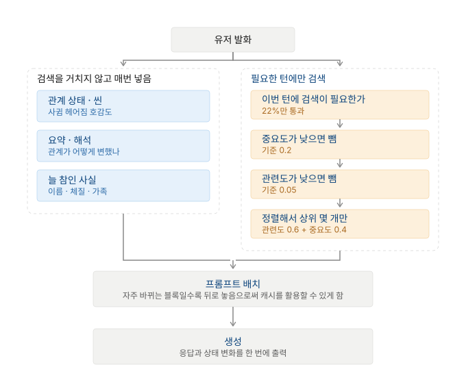

# 장기기억 시스템

> 사용자와 아주 오랫동안 대화하더라도 과거의 중요한 사건과 맥락을 최대한 정확하게 기억하면서, 비용과 응답 지연시간은 최소화할 수 있는가

### 정확하게 기억은 왜 해야할까?
- 캐릭터 챗은 유저와 봇과의 유대 형성이 중요하다고 생각함
- 유저와 봇만 기억하는 특정 사건이 있다고 가정해봤을 때 유저가 이 사건에 대해 언급했는데 봇이 기억을 못하면 유저 입장에서는 또 고장났네라고 생각하고 무의식속에서는 서비스 품질이 떨어진다고 생각할 것임
- 다만 일반 유저들도 LLM을 어느정도 써봤기 때문에 위의 결과가 LLM의 한계라고 어느정도는 인지할 것임
- 그럼에도 불구하고 타사 대비 경쟁력을 갖추려면 품질 쪽에서 우위에 있어야 함

### 어떤 데이터를 저장해야 할까?
- 데이터를 저장하는 이유는 빠르고 정확하게 기존의 데이터를 필요한 순간에 꺼내기 위함임
- 그럼 꺼내서 어디에 쓰는가. LLM은 매 턴 아래 같은 덩어리 하나를 받고 그 뒤를 이어 씀

```
[캐릭터 설정]  서준, 27세, 무뚝뚝한 츤데레
[기억]         저장해둔 것에서 꺼내와 채우는 자리
[최근 대화]
지우: 나 여동생 있는 거 알지
서준:
```

- 즉 이 문서의 질문은 전부 기억 자리를 무엇으로 채울 것인가로 환원됨
    - 무엇을 저장할지도 결국 이 자리에 넣을 후보를 만드는 일임
    - 무엇을 버릴지도 이 자리에 안 넣겠다는 결정임
    - 비용도 지연도 이 자리의 크기와 조립 방식에서 나옴
- 이 자리를 채우는 방법이 몇 가지인지부터 생각해봄
- 특정 행을 꺼낸다거나 특정 키워드가 포함된 행을 꺼낼 수 있음
- 데이터가 필요한 순간에 특정 행을 바로 꺼내는 것이 가장 속도가 빠르고 그 다음이 특정 키워드가 포함된 행임
    - 여기서 후자는 당연히 검색 시스템이라고 생각할 것임
    - 그런데 전자는 어떤 시스템인지 바로 떠오르지 않음
    - 이를 정의하는 것이 중요하다고 생각했고, 이를 상태 표현이라고 생각함
    - 특정 순간에 어떤 상태인지 클라이언트가 알고 있다면, 그 데이터를 바로 꺼내서 쓸 수 있음
    - 전공과목에서 배운 Finite State Machine이 떠오름
- FSM은 상태 집합과 전이 함수로 구성됨
    - 예를 들어 유저와 봇과의 관계를 낯섦 | 아는 사이 | 친구 | 썸 | 연인 | 다툼중 | 헤어짐 | 재회 로 정의할 수 있음
    - 또한 특정 호감도 혹은 특정 키워드가 포함되었을 때 다른 상태로 전이할 수 있게 됨
    - 이 전이 함수는 응답을 생성할 때에는 활용도가 떨어지지만 응답을 검토할 때에는 활용도가 높아짐
    - 예를 들어 기존 시스템이 호감도 X인 상태에서 친구끼리만 할 수 있는 대화를 수행했다고 했을 때, 친구끼리만 할 수 있는 대화인지 아닌지에 대한 검증을 할 수 있다는 것임
    - 그래서 상태 집합에 대한 정의를 상태, 호감도(숫자), 짧은 문장으로 다시 둠

#### FSM이 다루는 것
- 명확한 상태를 판정할 수 있는 것임
- 이를테면 나는 카페인을 좋아하지 않아라고 했을때 상태는 기존 상태, 기존 호감도, 카페인 불호로 전이할 것임
- 그런데, 나 오늘 열이 나고 아파라는 문장은 어떤 상태로든 판단이 불가능함
    - 특정 날에만 성립하기 때문임
    - 따라서 명제처럼 참 거짓을 구분하기 어려운 것들에 대해서는 검색 서비스가 필요함
- 즉, FSM은 명제처럼 참 거짓을 구분할 수 있는 것들에 대해서 다룸
- 이 부분에 대해서는 캐시를 적용해보는 것을 생각해볼 수 있다고 생각함

#### 검색이 다루는 것
- 반대로 검색은 특정 시점에만 참이었던 것을 다룸
- 나 오늘 열이 나고 아파는 지금은 참이 아니지만 그렇다고 없던 일도 아님
    - 상태로 두면 다음 날 거짓이 될 가능성이 있음
    - 그렇다고 버릴 수도 없는데 그 이유는 유저가 나중에 그때 아팠던 거 괜찮아졌냐고 물으면 답해야 함
    - 즉 언제라는 시점이 붙어야만 의미가 성립하는 것들임
- 그래서 저장 형태부터 달라짐
    - 상태는 값이 하나고 새 값이 오면 예전 값을 덮어씀
    - 사건은 계속 쌓이므로 덮어쓰지 않고 append함
- 사건은 쌓이기 때문에 필연적으로 다 넣을 수 없음
    - 상태는 개수가 정해져 있어서 고를 필요가 없지만 사건은 골라야 함
    - 이 고르는 문제가 검색의 본질이라고 생각함
    - 반대로 말하면 상태로 표현할 수 있는 것을 검색에 맡기는 것은 고를 필요가 없는 것을 굳이 고르게 만드는 것임

##### 검색은 항상 뭔가를 돌려준다는 것이 위험함
- 보통의 검색은 관련도 순으로 상위 k개를 돌려주는데, 이번 대화와 상관이 없어도 k개를 채움
- 따라서 관련도 점수가 기준에 못 미치면 하나도 안 꺼내도 되게 해야 함

##### 무엇을 검색 대상에 넣느냐가 검색 알고리즘보다 중요함
- 대화 원문을 전부 검색 대상으로 넣으면 영양가 없는 검색 데이터가 나올 것임
- 그래서 사실, 사건, 해석만 뽑아서 넣어야 한다고 생각함
- 즉, 검색 품질을 올리는 첫 단계는 무엇을 저장할지 고르는 쪽임

##### 그래서 검색은 매번 돌릴 필요가 없음
- 유저 발화의 대부분은 과거를 부르지 않는다고 생각함
    - 오늘 좀 피곤하네는 과거를 꺼낼 이유가 없다고 생각함
    - 그때 아팠던 거 어떻게 됐어는 과거 데이터가 필요함
- 검색이 필요한 턴인지 먼저 판정하는 로직을 넣어서 Mock 데이터 기반으로 실험했더니 22% 정도만 통과함

#### 두 방식은 캐시 관점에서도 대척점에 있음
- 상태는 토큰 수가 고정이고 자주 바뀌지 않으므로 캐시가 유지됨
- 검색 결과는 매 턴 달라지므로 캐싱이 어려움
- 즉 캐시를 둘 때 배치 순서는 무엇을 상태로 두고 무엇을 검색으로 둘지에 따라 정해짐

### 요약의 필요성
#### 검색의 한계
- 사건을 쌓아두고 검색으로 고르는 것만으로는 안 되는 지점이 옴
    - 옛날 사건은 검색에도 잘 안 잡힐 뿐더러 되더라도 맥락 파악이 어려울 가능성이 있음
    - 이를테면, 유저가 우리 처음에 어색했잖아라고 하면 특정 사건 하나가 아니라 그 시기 전체를 알아야 함
- 그래서 요약이 필요다고 생각했는데, 이 요약은 상태와 검색 어느쪽에도 속하지 않음
    - 요약은 검색을 안 거치고 매번 컨텍스트로 들어가게 되는데, 이는 앞에서 언급한 상태의 동작과 동일함
    - 그런데 요약은 명제도 아니고 특정 시점의 사건도 아니고 오히려 여러 사건을 압축한 것임
    - 즉 상태도 사건도 아님
- 그런데 요약은 크기가 큼
    - 테스트때 매번 넣는 블록을 다 합치면 약 1200토큰 정도인데 그중 요약이 700임

#### 요약은 한계가 없을지 테스트 해봄
##### 요약은 사실 보존을 기대하면 안된다는 사실을 알게 됨
- 요약이 사실을 얼마나 남기는지 직접 재봄
- 정답지 항목 11개를 대화에 심어두고 요약을 통과시킴

```
대화 원문 11/11  →  세션 요약 10/11  →  전체기간 요약 1/11
```

- 세션 요약까지는 거의 다 남는데 전체기간 요약에서 90%가 사라짐
    - 사라진 것: 고양이 이름, 직업, 카페인 민감, 여동생, 2년 선배
    - 남은 것: 관계가 냉담했다
- 압축률이 문제라고 생각해서 분량을 늘려봤음
- 기존 문장 대비 3배를 늘려 압축하도록 했고, 사실을 우선하여 담으라고 프롬프트로 지시를 내렸더니 7/11를 기억함
- 어쨋든 손실이 발생함

#### 요약의 역할을 기존 사실 기억이 아닌 관계가 어떻게 변했는지만 저장하도록 함
- 요약이 사실을 못 담는 것이 아니라 사실을 담기에 적합한 형식이 아니라고 판단함
    - 요약은 문장이고 문장은 압축될 때 구체적인 것부터 버려짐
- 요약은 언제 무슨 일이 있었고 관계가 어떻게 변했는지만 담당함
- 그래서 어떤 상황에서 어떤 일이 발생했다는 사실은 상태 쪽으로 넣는게 맞다고 생각이 들었음

#### 요약은 어떤 방식으로 쓸 것인가
- 매 턴마다 요약에 대해 요약하고 이를 반복하면 요약이 결국 닳게 되므로 요약은 전체를 다시 쓰는 것이 맞다고 생각함
- 그래서 세션 요약들에 대해서 다시 쓰는 방식을 선택함
- 이렇게 생각하게 된 배경은 요약이 닳는 원인이 턴을 몇 번 반복했는지에 달려있다고 생각해서 실험을 수행해보았음
    - 2턴과 12턴을 비교해보았는데 둘 다 1/11로 기록됨
    - 즉 LLM이 압축하는 방식이 dominant하게 작용함
    - 그래서 몇 번째 턴인지는 상대적으로 덜 중요함

#### 시스템 구조도



### 실험
#### 실험은 전적으로 Claude Code로 모든 것을 작성함
##### local 환경에서 테스트해보고 유의미한 수치를 지니는 것에 대해서 api call을 함
- 같은 대화, 같은 질문, 같은 토큰 예산으로 여러 방식을 나란히 돌림
- 무료 한도가 있으므로 어디에 쓸지를 먼저 정했음. 무엇을 어떻게 쟀는지는 아래와 같음

```
API를 안 쓴 것 — 모델을 부르지 않아도 답이 나오는 것들

  회상 정확도        각 방식이 고른 목록에 정답 근거가 있는지만 세면 됨
  파이프라인 도달률   구현에 데이터를 통과시켜 보는 것
  검색 여부 판정과 임계값 조합   수십 번 돌려야 해서 무료 한도로는 불가능함
  비용              단가표에 토큰 수를 곱한 계산
  지연              구현에서 걸린 시간을 잼

API를 쓴 것 — 모델이 실제로 뭐라고 답하는지 봐야 하는 것들

  응답 품질          26문항을 6가지 방식에 던짐. 총 156회 호출
  요약 손실          정답지 11개를 심고 요약을 거치게 함
  기억 주입 공격      가짜 기억을 심으려는 발화 45회
```

- 정답 근거로 답을 제대로 했는지만 API로 확인함

#### 평가 데이터는 정답을 먼저 만들고 대화를 만듦

```
1. 정답지 작성   무엇이 참이고 언제 등장하고 언제 바뀌는지 먼저 확정지음
2. 대화 생성     고양이의 이름인 나비를 3번째 세션 12번째 턴에서 말하게 하도록 유도하는 대화를 생성
3. 질문 파생     정답지를 참조하므로 채점 기준이 자동으로 정확해짐
```

- 이렇게 하면 어느 턴에 답의 근거가 있는지 아는 데이터가 나옴
- 이것이 왜 필요한지는 프롬프트를 놓고 보면 드러남

```
[캐릭터 설정]  서준, 27세, 무뚝뚝한 츤데레
[기억]         <- 이 자리를 무엇으로 채우느냐가 비교 대상임
[최근 대화]
지우: 나 여동생 있는 거 알지
서준:
```

- 평소에는 이 자리를 검색이 채우므로 여동생 얘기가 뽑힐 수도 있고 엉뚱한 것이 뽑힐 수도 있음
- 그런데 실험에서는 질문도 정답도 내가 다 알고 있음
- 그러니 검색을 아예 안 돌리고 정답지에 적힌 근거를 내가 직접 써넣을 수 있음

```
평소            [기억] = 검색기를 돌린 결과      무엇이 나올지 모름
정답만 넣기      [기억] = 나 여동생이랑 같이 살아  정답지를 보고 직접 써넣음
```

- 이건 실제로 서비스할 수 있는 방식이 아님
    - 서비스에서는 유저가 무엇을 물을지 모르므로 정답 근거를 미리 넣을 수 없음
    - 질문과 정답을 다 아는 실험에서만 가능함
- 이 방식을 생각한 이유는 동작을 구분하기 위해서임
    - 평소에 넣던 프롬프트로 정답이 틀리면 검색이 못 뽑아온 것인지 뽑아왔는데 모델이 못 쓴 것인지 구분이 안 됨
    - 답을 확실히 쥐여준 상태에서도 틀리는지를 보면 그 구분이 됨

```
답을 줬는데도 틀림   검색 문제가 아니라 모델이 못 쓴 것임
답을 주니까 맞음     검색이 못 찾은 것이 문제였음
```

- 앞으로 이 방식을 정답만 넣기라고 부르겠음

- 24세션 720턴을 만들었고 그중 65%는 정답지에 없는 잡담임
    - 전부 의미 있는 문장이면 검색이 아무거나 집어도 정답 근처가 결과도 나오므로 변별이 안 됨
- 사실이 바뀌는 상황도 심어둠
    - 직업을 마케팅 회사 대리로 두었다가 21번째 세션에서 스타트업으로 이직하게 함
    - 이직 이후에 대리라고 답하면 실패임

#### 비교 대상
- 여섯 가지를 돌렸는데 그중 둘만 실제 후보임
- 나머지 넷은 비교하려고 같이 돌린 것임

```
후보가 아닌 것
  기억 없음         기억을 아예 안 주면 정답률이 얼마까지 내려가는지
  대화 전체 통째로   전부 다 넣으면 정답률이 얼마까지 올라가는지, 대신 비용과 지연은 얼마나 드는지
  최근 30턴만        가장 단순한 방법만으로 어디까지 되는지
  정답만 넣기        답을 알려줘도 못 쓰는지 보려는 확인용

후보
  현행 방식 재현
  제안안
```

- 후보 둘을 비교해서 결론을 내고 나머지 넷은 그 둘이 어디쯤 있는지 보려고 돌린 것임

- 현행 방식 재현은 실제 시스템을 짐작해서 만든 것임
    - 계층 메모리와 검색과 Selector를 조합한다는 설명만 보고 재구성함
    - 프롬프트는 장기 요약, 관련도 상위 5개, 최근 10턴으로 채움
- 제안안과 무엇이 다른지를 표현하면 아래와 같음

```
                              제안안    현행 재현

늘 참인 사실을 매번 넣는가        넣음      안 넣음
  이름이나 체질처럼 항상 참인 것을 검색에 맡기지 않고 무조건 넣는 블록임

이번 턴에 검색이 필요한지 보는가   봄        안 봄
  안 보면 유저가 무슨 말을 하든 매 턴 검색을 돌리게 됨

점수가 낮으면 버리는가           버림      안 버림
  안 버리면 관련이 없어도 자리를 채워야 하므로 항상 5개가 들어감

중요도까지 보고 뽑는가           봄        안 봄
  안 보면 관련도만으로 순위가 정해져서, 지나가는 잡담이 중요한 사실보다 위에 올 수 있음

무엇을 검색 대상으로 삼는가       추출 항목  대화 원문 전체
  원문을 다 넣으면 잡담이 후보에 섞임
```

- 즉 현행 재현은 관련도 순으로 5개를 채우는 검색 방식임

#### 회상 정확도
- 각 방식이 이번 턴에 넣겠다고 고른 목록 안에 정답 근거가 있는지를 셈
- 모델은 부르지 않음. 답을 채점하는 것이 아니라 정답 근거가 프롬프트에 들어갔는지만 보는 것임

```
1. 질문 10개와 각각의 정답 근거를 손으로 정함
     우리 고양이 이름 뭐였지      -> 고양이 이름은 나비
     그 카페 같이 가기로 했잖아    -> 카페에 가기로 한 약속

2. 각 방식에 질문을 주고 무엇을 고르는지 받음

3. 고른 목록 안에 정답 근거가 있으면 맞은 것으로 셈
```

- 언제 묻느냐에 따라 난이도가 완전히 달라지기 때문에 턴을 나눠서 측정함

```
근거가 나온 뒤 5턴     최근 턴만 넣어도 맞음
근거가 나온 뒤 30턴    애매한 구간
근거가 나온 뒤 300턴   검색이 있어야 맞음
```

- 질문하는 시점까지의 대화만 보여줌. 그 뒤는 아직 일어나지 않은 것으로 처리함
- 세 결과를 그냥 평균 내면 안 됨
    - 실제 대화에서 세 경우가 같은 빈도로 일어나지 않기 때문임
    - 사람은 대개 방금 한 얘기를 이어서 하고 아주 옛날 일을 꺼내는 경우는 드묾
    - 그래서 가까운 것을 가리키는 경우 75%, 중간 20%, 먼 경우 5%로 잡고 그 비율대로 가중함
- 이 비율은 추정치이고 근거가 없음
    - 프로덕션 환경이라면 모니터링을 통해 조정이 필요함

```
최근 15턴만        75%
추출 항목만 검색    81%
현행 방식 재현      96%
제안안             96%
정답만 넣기        100%
```

- 제안안이 현행보다 잘 찾을 것이라고 예상했는데 96%로 동일하게 나옴
- 최근 15턴만 넣어도 75%가 나옴
    - 정교한 검색과의 차이는 6%p뿐임
    - 즉 검색 구조를 정교하게 만드는 것의 이득이 생각보다 작음

##### 이 숫자를 읽을 때 감안해야 하는 것
- 질문이 10개뿐임. 응답 품질은 26문항으로 쟀는데 이쪽은 그보다 적음
- 정답 근거를 하나만 정답으로 봤음. 실제로는 다른 근거로도 답할 수 있음
- 임베딩을 안 쓰고 글자 두 개씩 잘라 겹치는 정도로 검색함
    - 임베딩을 쓰면 문서 전체를 벡터로 만들어야 해서 호출량이 커짐
    - 무료 한도는 응답 품질 실험에 쓰는 편이 낫다고 판단함
    - 그리고 이 실험은 키 없이도 누구나 다시 돌릴 수 있게 두고 싶었음
    - 대신 실제 서비스의 의미 기반 검색과는 결과가 다를 수 있음
    - 특히 말이 겹치지 않고 뜻만 통하는 경우를 놓침. 이쪽이 불리하게 나왔을 것임
- 참조 깊이 가중치 75, 20, 5는 내 추정이고 실제 로그의 분포를 모름
    - 이 분포에 따라 검색의 이득이 크게 달라지므로 실제 로그로 대체해야 함
- 그리고 이것은 정답 근거가 프롬프트에 들어갔는지를 재는 것이지 답을 잘했는지가 아님
    - 회상이 96%여도 응답 품질은 65%였음
    - 즉 회상은 품질의 상한이지 품질이 아님

#### 여기까지는 전부 시뮬레이션이었음
- 앞의 숫자들은 직접 작성한 함수가 이번 턴에 넣을 목록을 돌려주면 그것을 세는 방식이었음
- 실제로 저장하고 꺼내서 프롬프트를 조립하는 과정을 거친 것이 아님
- 그래서 프로토타입을 실제로 만들었음
    - SQLite에 계층별 테이블을 만들고 저장 경로와 읽기 경로를 다 구현함
    - 720턴을 실제로 하나씩 집어넣고 질문을 실제 읽기 경로로 통과시킴

#### 그랬더니 시뮬레이션과 완전히 다른 숫자가 나옴
- 정답 근거가 프롬프트까지 실제로 도달한 비율이 18문항 중 4개, 22%였음
- 시뮬레이션에서는 90%대가 나왔는데 실제 구현에서는 22%임
    - 질문 세트가 달라서 두 숫자를 그대로 빼면 안 되지만 격차가 너무 큼
- 원인을 찾아보니 실수가 발생했었음
    - 설계에서 매번 넣는 블록을 정의해놓고 구현에서 통째로 빼먹었음
    - 검색해서 꺼내는 쪽만 만들고 늘 참인 것을 넣는 쪽을 안 만든 것임
    - 그래서 해당 블록을 넣어줬더니 성공률이 22%에서 56%가 됨
- 이후 판정과 여러 임계값을 수정해서 성공률을 61%까지 올림

```
검색만 구현한 상태            22%
매번 넣는 블록을 연결          56%   
검색 여부 판정과 임계값 수정   61%
```

- 각 모듈의 성공률을 개별로 측정했을때는 모두 높은 수치가 나왔었음
- 그런데 이를 연결한 시스템은 개별 모듈의 성공률에 한참 못미치는 수치가 나옴
- 그래서 임계치(검색 결과를 넣을지 말지 등)를 정하는 파라미터를 하나씩 바꾸면 안 된다는 생각을 하게 됨

#### 검색 결과를 넣는 기준
- 검색 결과를 무조건 넣지 않고 네 단계를 거치게 함

```
1. 이번 턴에 검색이 필요한가        아니면 검색 자체를 안 돌림
2. 중요도가 낮으면 후보에서 뺌       기준 0.2
3. 이번 대화와 관련도가 낮으면 뺌    기준 0.05
4. 남은 것을 정렬해서 상위 몇 개만   0.6 * 관련도 + 0.4 * 중요도
```

- 여기서 중요한 것은 2와 3을 합산하지 않고 각각 따로 떨어뜨린다는 점임

```
중요한데 이번 대화와 무관    3에서 탈락
관련은 있는데 중요하지않음   2에서 탈락
중요하고 관련도 있음        통과
```

- 관련도가 아주 높으면 낮은 중요도를 상쇄해버리기 때문임
- 오탐이 발생할 수 있음
- 그래서 합치기 전에 각 기준에서 먼저 떨어뜨림

- 2, 3을 통과한 것들에 대해서는 4번을 적용함
    - 이미 여러 번 꺼낸 기억은 점수를 깎음으로써 같은 얘기를 반복하지 않게 함


#### 응답 품질
- 여기 실험부터 실제 gemini api call을 사용함
- 그래서 실제로 모델에게 물어보고 답을 받아 채점함
- 26문항을 6가지 방식에 동일하게 던짐 

```
기억 없음                    12%
기억 없이 지어내지 마라 규칙만  15%
최근 30턴만                  23%
정답만 넣기                  65%
현행 방식 재현                65%
제안안                       73%
```

- 기억이 있고 없고가 12%에서 73%로 6배인 것으로 보아 메모리가 어느정도 중요한 역할을 한다는 것은 확인됨
- 그런데 제안안 73%와 현행 65%는 2문항 차이임
    - 반복해서 돌려보니 약간의 노이즈 차이였음
    - 26문항으로는 8%p를 가릴 수 없고 300~400문항이 필요함
    - 즉 제안안이 현행보다 낫다고 단정할 수 없음

##### 총점보다 유형별로 갈라 보는 것이 유용했음
```
                      제안안   현행
한 번 언급된 사실        4/4    2/4
비슷한 말이 방해할 때     4/4    3/4
바뀐 사실의 최신 버전     3/4    3/4
없는 일을 지어내지 않기   2/4    3/4
여러 세션에 걸친 패턴     1/4    1/4
```

- 제안안이 현행보다 잘하는 것을 살펴보면 한 번 언급된 사실과 비슷한 말이 방해가 되지 않는 경우임
    - 이는 매번 넣는 블록이 담당하는 영역이 있기도 하고 관련도로 잘라내는 부분이 있기 때문임
- 없는 일을 지어내지 않기는 오히려 현행이 나음
- 여러 세션에 걸친 패턴은 양쪽 다 1/4임
    - 사실 하나를 꺼내는 문제가 아니라 여러 사실을 관통하는 해석을 만드는 문제이기 때문임
    - 매번 넣는 블록으로도 그리고 검색으로도 해결되지 않는다는 점을 알게됨

##### 프롬프트에 정답만 넣기 방법도 적용해 봤음
- 사실 이게 정답을 맞출 확률이 가장 높지 않을까라고 생각했는데 그렇지 않았음
- 정답만 넣으면 요약도 관계 상태도 늘 참인 사실도 없음
    - 그래서 없는 일을 지어내지 않기 문항에서 아는 게 없으니 오히려 지어냄
    - 이를테면 강아지가 없는 상대방에게 너의 강아지 이름은 무엇이었지? 라는 질문에 초코라고 대답을 함
- 즉 모른다고 말하려면 무엇을 아는지를 알아야 함
    - 부정하는 능력은 정답 근거가 아니라 내가 아는 범위가 어디까지인지에서 나옴

##### 지어내지 마라는 규칙만으로 막힐 것이라고 봤는데 아니었음
- 규칙만 주고 기억을 안 주면 0/6에서 2/6에 그치고 반면, 기억을 준 제안안은 4/6임
- 지어내기를 막는 것은 지시문이 아니라 기억이라는 사실을 알게됨

##### 생각보다 기억을 활용을 잘 못함
```
활용 실패  35%   근거를 다 넣어줬는데도 모델이 못 씀
검색 실패   8%   근거를 못 찾아서 못 씀
```

- 활용 실패가 검색 실패의 4배임
- 즉 지금 가장 큰 실패 원인은 메모리 구조가 아니라고 생각했음
- 따라서 질문의 배치와 프롬프트가 조금 더 중요하다고 생각함

#### 비용
- 단가표에 토큰 수를 곱한 계산이라는 것임
    - 단가는 공개된 값이고 입력 토큰 수는 블록별로 정한 예산임
    - 캐시 적중률은 실제 측정이 아니라 시뮬레이션임
    - 따라서 절대 금액보다 상대 비교를 봐야 함

```
모델            Gemini Flash 기준 입력 0.75 출력 3.75 캐시 0.075 (백만 토큰당)
월 사용량       1만 턴
응답 길이       400토큰
컨텍스트 예산    4000토큰
```

```
캐시가 전혀 안 될 때          $45.00
배치 순서를 고쳤을 때         $23.98    입력 기준 63% 절감
입력을 아예 0으로 만들어도     $15.00
모델을 한 단계 내리면          $2.90
```

- 배치 순서만 바꿔서 63%가 줄어드는 것은 예상보다 컸음
    - 왜냐하면 최근 N턴을 1턴씩 밀어내면 매 턴 앞부분이 바뀜
    - 앞이 한 토큰만 바뀌어도 뒤 계산이 전부 무효가 되므로 캐시가 매 턴 날아감
    - 여러 턴을 묶어서 밀어내니 캐시 재활용이 49%에서 79%가 됨

#### 지연
- 기억을 모아서 붙이는 데 걸리는 시간을 잼
- 검색에는 검색과 고르기 기능이 있음
    - 검색은 비슷해 보이는 것을 넉넉히 뽑아옴
    - 고르기는 그 후보 중에 이번 대화에 실제로 쓸 것을 정함
    - 비슷한 것과 쓸모 있는 것이 다르기 때문에 단계가 나뉨

```
검색이 필요한 턴인지 판정          5ms
검색 - 후보를 뽑아옴              0.13ms
후보 중 넣을 것 고르기 - 재정렬 모델   20~50ms
후보 중 넣을 것 고르기 - LLM에게 시키면 200~800ms
```

- 지연의 상한은 최대 400ms 정도로 잡았음
- 검색이 생각보다 일찍 끝남
    - 검색 대상이 대화방 하나 안에 있어서 개수가 3000개 정도 뿐이라 그런 것이라 생각함
- 그래서 지연은 고르기를 누구에게 시키느냐에 따라 dominant함
    - 고르는 일 자체는 필요하지만 그것을 LLM으로 할 이유는 없음
        - 속도가 너무 느리고 로컬에서도 어느정도 고를 수 있기 때문임

### 수천에서 수만 턴까지 버티는가
- 과제의 질문이 아주 오랫동안이므로 턴이 쌓여도 안 터지는지를 따로 봐야 함
- 턴 수가 늘어도 커지지 않아야 하는 것이 세 가지 있음

다음 수치는 모두 가정한 값임
```
한 턴에 넣는 양      800 토큰       최근 N턴, 고정 블록, 검색분이라 대화 길이와 무관하게 고정 값
검색 대상 개수       3000개         원문이 아니라 추출한 것만 넣기 때문임
저장 용량           턴당 210바이트    1만 턴이면 2.1MB
```

- 셋 다 상수임
    - 즉 대화가 길어져도 매 턴 비용과 지연은 거의 그대로임
- 그런데 요약을 다시 쓰는 작업은 턴 수에 비례해져 커짐
    - 앞에서 세션 요약들을 모아 다시 쓴다고 정했는데 세션 수가 늘면 읽을 것도 늘어남
    - 즉 세션 요약 관련해서 별도의 조치를 하지 않으면 매우 긴 시간동안 이어지는 턴에 대해서는 버틸 수 없음
- 요약이 검색이나 상태관리보다 중요하다는 사실을 뒤늦게 깨달아서 요약관련해서 구조는 따로 생각을 못함

### 운영시 복잡도
- 상태로 다루려면 무엇을 상태로 둘지 사람이 미리 정해둬야 함
    - 관계 단계를 어떻게 나눌지, 어떤 항목을 상태로 관리할지를 확정해야 함

#### 상태를 전이할때 생길 수 있는 문제점

- A -> B로 상태가 바뀌었을때 A상태에서만 유효했던 데이터에 대한 수정이 필요함
- 즉, update, delete abnormal이 발생함
